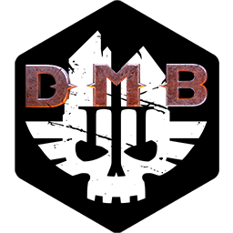

## Darktide Mod Builder  

A Windows CLI program created to ease the ever-growing pain of creating, building and uploading mods for Darktide.

Made in [Node.js](https://nodejs.org/en/). Compiled with [pkg](https://github.com/zeit/pkg). Forked from [Vermintide-Mod-Builder](https://github.com/Vermintide-Mod-Framework/Vermintide-Mod-Builder).

### Quickstart Guide

1. Download and export **[the latest release](https://github.com/Darktide-Mod-Framework/Darktide-Mod-Builder/releases/latest)**.
2. Run `dmb config` to create default .dmbrc config file in the folder with the executable.    
3. Run `dmb create <mod_name>` to create a new mod. This will create a new DMF-dependent mod in the `mods` folder from a template. 
4. The main functionality of your mod should be added to `<mod_name>/scripts/mods/<mod_name>/<mod_name>.lua`.

### Usage

```bash
dmb <command> [command-specific params]
```

See **[Vermintide Mod Builder wiki](https://github.com/Vermintide-Mod-Framework/Vermintide-Mod-Builder/wiki)**

### Building DMB executable

```bash
npm run setup
npm run build
```

Alongside the executable, a zip archive will be created with template and mods folders included.

### Tests

```bash
npm test
```
